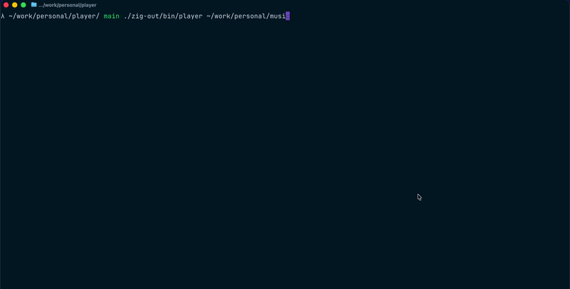

# Player

A simple audio player written in Zig.



## Build

To build the project, run:

```bash
zig build
```

For a release build, run:

```bash
zig build --release=fast
```

## Run

To run the player, use:

```bash
zig build run
```

This will run the player. You might need to provide a path to your music directory as an argument, for example:

```bash
zig build run -- /path/to/your/music
```
